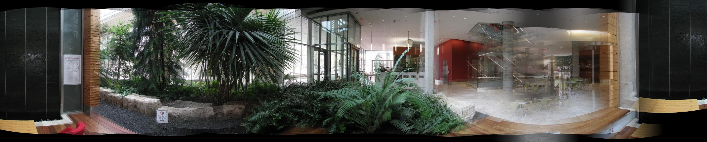

# 360 Panorama
```sh
1. Take pictures on a tripod (or handheld)
2. Warp images to spherical coordinates
3. Extract features
4. Align neighboring pairs using RANSAC
5. Write out list of neighboring translations
6. Correct for drift
7. Read in warped images and blend them
8. Crop the result and import into a viewer
```

# Effect
#### pictures1

#### pictures2


# Usage
#### Step1
```sh
Modify <line13~18> in <main.m> according to your needs.
```
#### Step2
```sh
Run main.m to get the result.
```