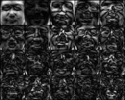
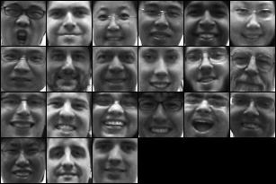
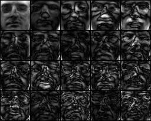
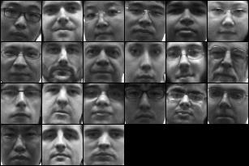

# Face Recognition via Eigenface
```sh
1. PCA to compute eigenface, show eigenface images
2. Project a face image into the face space, show the reconstructed face
3. Face Detection: finding the size and position of a face in an image
4. Face Recognition: Find the person in the training set for each detected face.
```

# Effect
#### smiling


#### nonsmiling



# Usage
## Get results
#### Step1
```sh
Modify <line15~17> in <main.m> according to your needs.
```
#### Step2
```sh
Run main.m to get the results.
```
## Show results
```sh
Modify <line10~12> in <showResults.m> according to your needs.
```
#### Step2
```sh
Run showResults.m to show the results.
```