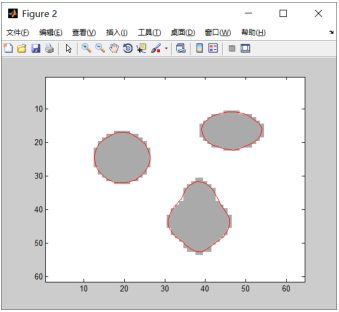

# LevelSet
```sh
Implementation of Level Set Evolution Without Re-initialization: A New Variational Formulation.(CVPR 2005)
```

# Effect
#### Origin image

#### Processed image


# Usage
#### Step1
```sh
Modify the image_path in line14-16 of main.m.
```
#### Step2
```sh
Run main.m to get the result.
```

# Derivation
```sh
see Derivation.docx please.
```