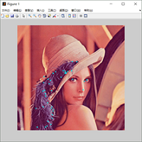

# SIFT
```sh
scale-invariant feature transform.
The version is a bad implementation, I would improve it when I'm free.
```

# Effect
#### Origin image

#### Processed image


# Usage
#### Step1:
```sh
Modify the image_path in line7 of test.m.
```
#### Step2:
```sh
Run test.m to get the result.
```